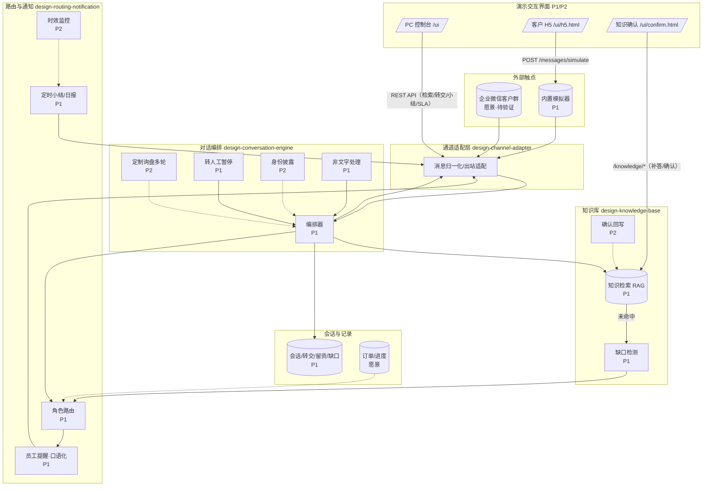

# 04 系统架构

> **文档定位**：定义系统边界、架构视图、模块职责、关键流程和部署拓扑；不写具体依赖版本、表字段或接口细节。
> **上游输入**：`docs/03-prd.md` §3、`docs/02-srs.md`、`docs/env/local-env.md`、`ai/project-rules.md`。
> **下游输出**：约束 `docs/05-tech-spec.md`、`docs/06-db-design.md`、`docs/07-api-spec.md`、`docs/design/*`、`docs/08-dev-plan.md`。
> AI 生成初稿，**人工确认**。完整框架——架构图 + 子系统表（每行带 阶段/状态/指向 design-*）。
> 按 global-rules §8 积累式演进：框架一次铺满（含 P2/愿景骨架），细节随阶段在原位完善。

## 0. 文档元信息

| 项 | 内容 |
|---|---|
| 输入来源 | `docs/03-prd.md` §3；`docs/05-tech-spec.md`；`ai/project-rules.md` |
| 覆盖功能 / REQ | REQ-1~REQ-14；REQ-15/16/17 保留愿景约束 |
| 当前状态 | 已确认（P1+P2 Demo 收官；愿景待技术验证） |
| 最后更新 | 2026-06-29 |

## 1. 整体架构图

> 数据流（自上而下）：外部客户消息 → 通道适配层归一化 → 对话编排（检索/留资/缺口/转交/身份/非文字）→ 出站（回客户 + 提醒员工）；旁路：知识库（RAG）、路由与通知、会话状态、定时小结。P1 实线部分，P2/愿景为骨架。

实线＝P1 范围；虚线＝P2/愿景骨架（存在但不在此阶段细化）。

## 2. 子系统划分（模块可追溯到 03 功能点）

| 子系统 | 职责 | 阶段 | 状态 | 指向详细设计 |
|---|---|---|---|---|
| 通道适配层（Channel Adapter） | 对接三种通道（模拟器/真实微信号/合规途径），消息归一化与出站适配，隔离平台与合规差异 | P1（模拟器）；真实通道为对比 Spike | P1-骨架 | `docs/design/channel-adapter.md` |
| 对话编排（Conversation Engine） | 单条消息的处理编排：走知识问答 / 留资 / 缺口 / 转交，及转人工暂停·非文字处理（P1）、多轮·身份（P2）分支 | P1 主体 + P2 分支 | P1-骨架 | `docs/design/conversation-engine.md` |
| 知识库（Knowledge Base / RAG） | 知识检索与作答、缺口检测；P2 增确认回写 | P1 + P2 回写 | P1-骨架 | `docs/design/knowledge-base.md` |
| 路由与通知（Routing & Notification） | 场景→角色路由、口语化员工提醒、定时小结；P2 增时效监控 | P1 + P2 监控 | P1-骨架 | `docs/design/routing-notification.md` |
| 会话与记录（Session & Records） | 会话/转交/留资/缺口/通知的持久化；订单/进度骨架 | P1 + 愿景订单 | P1-骨架 | `docs/06-db-design.md` |
| 定时任务（Scheduler） | 触发定时小结；P2 触发时效检查 | P1 + P2 | P1-骨架 | `docs/08-dev-plan.md`（Sprint-5） |

> 每个子系统当前状态为 `骨架`（初次生成）；进入 Sprint 实现时推进到 `P1-已设计` → `P1-已实现`（global-rules §8.1）。

## 3. 技术选型理由（为什么这么选 / 不选什么）

> 具体版本见 `docs/05-tech-spec.md`；本节讲「为什么」。

- **通道适配层先行（而非直连企业微信）**：企业微信外部群机器人能力 Sprint-0 **已核实不成立**（见 `docs/research/sprint-0-wework-findings.md`）。把平台依赖收敛到一层适配器、内置模拟器，使核心对话价值先行验证、不被平台风险阻塞；真实通道走「真实微信号 vs 合规途径」对比（见 `docs/research/channel-validation-plan.md`）。
- **单轮 RAG 作为 P1 答疑主路径**：愿景中绝大多数客户问题是「产品参数/选型/标准 FAQ」（单轮可答），RAG 足以覆盖；多轮定制引导（需状态机）推迟 P2，避免首版过度复杂。
- **「答不上→留资转人」而非「硬答」**：愿景反复强调不编造、不乱猜（语音/订单进度/防雷参数都走转人）。架构上把「缺口检测」作为一等公民，与「检索作答」并列。
- **通知走消息通道、不建独立功能前端**：愿景明确员工/经营者「无需打开别的页面」。P1 不做功能前端（P2 仅在「知识确认」必要时评估功能页面）；P1/P2 收官后补了**演示交互界面**（3 页：`/ui` PC 控制台 + `/ui/h5.html` 客户 H5 扫码 + `/ui/confirm.html` 知识确认，演示工具、非功能前端），不改此原则。
- **业务知识归属在客户方**：知识写入需经拍板人确认（P2 回写）；系统只整理录入，不擅自把临时答复固化。
- **不选**：不选个人微信**商用**非官方自动化（合规与封号风险，商用永久禁止；非商用验证例外见 DEC-7，与 §2「真实通道为对比 Spike」一致）；不在 P1 引入复杂对话状态机/售后推理（高风险 AI，推迟验证）。

## 4. 部署 / 运行拓扑约束

> 本机环境见 `docs/env/local-env.md`；资源约束见 `docs/env/context-and-constraints.md`。
- **本机单机（Demo）**：Docker Desktop（PG pgvector + TEI embedding）+ uvicorn（绑 0.0.0.0:8000）；模拟器通道（客户侧）；演示交互界面（`/ui` / `/ui/h5.html` / `/ui/confirm.html`）
- **公司服务器（后续）**：Linux；**待确认**（资源/部署方式/是否容器化）
- **远程服务**：**待确认**（是否用云；企微真实通道需公网回调，待 REQ-15 替代通道选定）
- 边界：Demo 全程本机（含 TEI 模型加载）；真实通道/订单/售后＝愿景，跨拓扑边界

---

**追溯**：功能→REQ 见 `docs/02-srs.md`；子系统内部分别见 `docs/design/`；数据落地见 `docs/06-db-design.md`；接口见 `docs/07-api-spec.md`。
